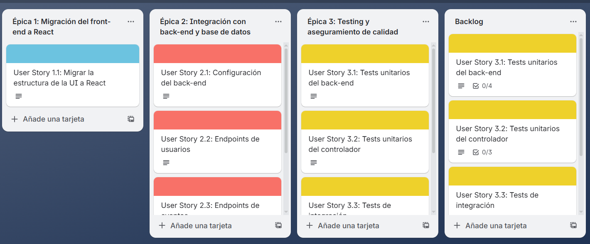
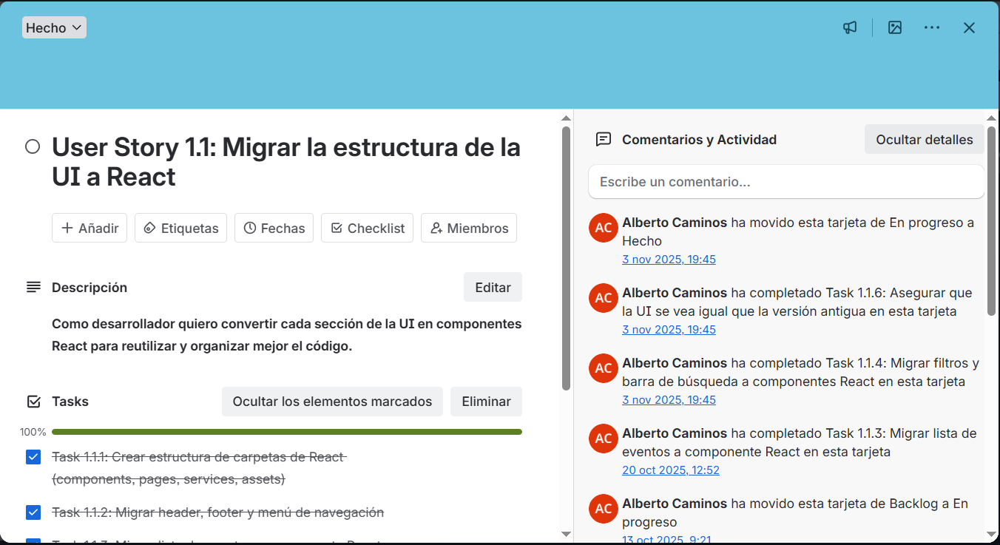
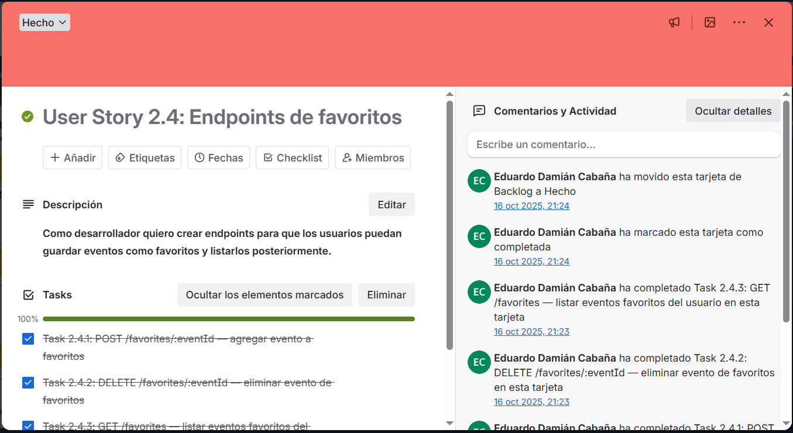
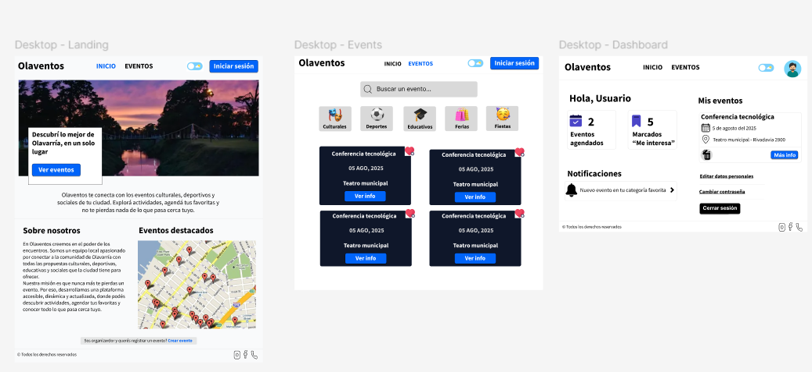
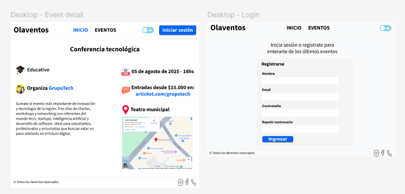
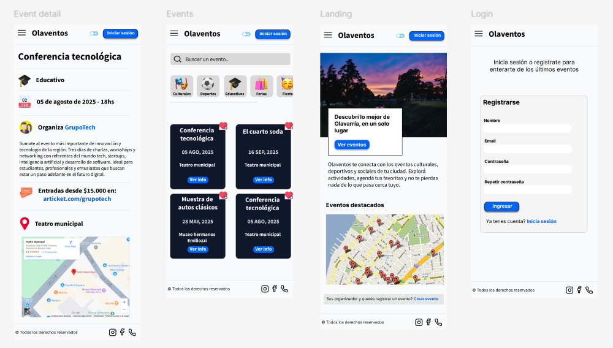
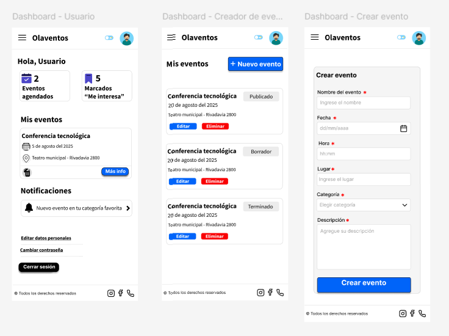

# 🛠️ Herramientas del Proyecto – Olaventos

Este documento reúne las herramientas externas utilizadas durante el desarrollo del proyecto, junto con capturas que muestran el flujo de trabajo real.
---

## 📌 Trello – Organización y Gestión del Proyecto

Trello se utilizó para planificar las tareas, dividirlas por secciones (Frontend, Backend, Diseño, Deploy) y llevar control del progreso general del proyecto.

### 📷 Capturas del tablero

---

## 🎨 Figma – Diseño UI/UX

En Figma se desarrollaron los wireframes, prototipos y pantallas finales del proyecto. El objetivo fue definir la estructura visual y la experiencia de usuario antes de implementar el frontend.

### 📐 Capturas de diseños iniciales

